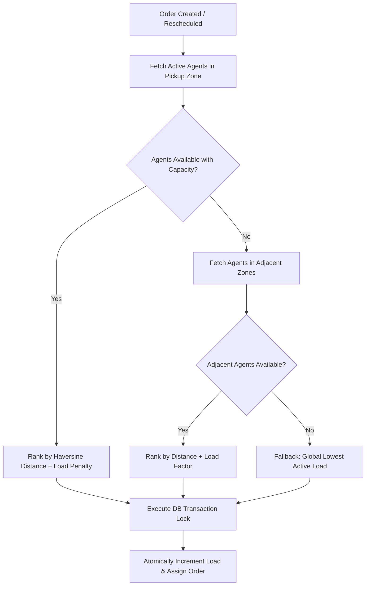

# System Design: LogiTrack Engine Architecture

## 1. Executive Summary & Design Principles
LogiTrack Engine is an enterprise-grade last-mile delivery orchestrator designed to solve complex multi-tier freight pricing, autonomous agent dispatching, and high-reliability customer lifecycle communication. The system is architected around three foundational pillars:
1. **Dynamic Configuration with Zero Hardcoding**: Pricing rules, zone geographic boundaries, base slabs, and surcharges are decoupled from source code into a normalized schema.
2. **Deterministic & Concurrency-Safe State Machines**: Order progression follows a strict lifecycle backed by an append-only audit trail and transactional database locks.
3. **Pure-Engine Algorithmic Isolation**: Core mathematical routines (Volumetric weights, Haversine spatial distances, SLA evaluations) are implemented in pure TypeScript with zero external dependencies for maximum testability and sub-millisecond execution.

---

## 2. Dynamic Rate Engine & Zone Detection

### 2.1 Zone & Routing Resolution
Every shipment origin and destination is resolved via a high-performance pincode mapping registry (`PincodeMapping` $\to$ `Zone`). A delivery scope is classified into:
- **`INTRA_ZONE`**: $\text{pickupZoneId} = \text{dropZoneId}$
- **`INTER_ZONE`**: $\text{pickupZoneId} \neq \text{dropZoneId}$

```
[Pickup Pincode] ──> PincodeMapping ──> Pickup Zone \
                                                      ──> Scope: (Intra / Inter Zone)
[Drop Pincode]   ──> PincodeMapping ──> Drop Zone   /
```

### 2.2 Volumetric & Chargeable Weight Heuristics
Logistics carriers are bounded by vehicle cargo volume as well as mass. The engine enforces the IATA cubic standard:
$$\text{Volumetric Weight (kg)} = \frac{\text{Length (cm)} \times \text{Breadth (cm)} \times \text{Height (cm)}}{5000}$$
$$\text{Chargeable Weight (kg)} = \max(\text{Actual Scale Weight}, \text{Volumetric Weight})$$

### 2.3 Rate Card Matrix & Total Quotation
The system executes a dynamic lookup for the active `RateCard` matching `(orderType, scope)` where `orderType` $\in \{\text{B2B}, \text{B2C}\}$.
$$\text{Extra Weight (kg)} = \max(0, \text{Chargeable Weight} - \text{Base Weight})$$
$$\text{Subtotal} = \text{Base Rate} + (\text{Extra Weight} \times \text{Per-Kg Rate})$$
$$\text{COD Fee} = \begin{cases} \max(\text{COD Surcharge}, \text{Min COD Fee}) & \text{if PaymentType} = \text{COD} \\ 0 & \text{if PaymentType} = \text{PREPAID} \end{cases}$$
$$\text{Total Charge} = \text{Subtotal} + \text{COD Fee} + \left((\text{Subtotal} + \text{COD Fee}) \times \frac{\text{Fuel Surcharge \%}}{100}\right)$$

---

## 3. Smart Auto-Assignment & Concurrency Controls



### 3.1 Pure Haversine Proximity Ranking
Rather than relying on heavy external GIS libraries, the engine implements the pure spherical Haversine formula:
$$d = 2R \cdot \arcsin\left(\sqrt{\sin^2\left(\frac{\Delta \phi}{2}\right) + \cos(\phi_1)\cos(\phi_2)\sin^2\left(\frac{\Delta \lambda}{2}\right)}\right)$$
where $R = 6371\text{ km}$, $\phi$ is latitude, and $\lambda$ is longitude in radians.

### 3.2 Candidate Scoring Function
To prevent overloading nearby agents while maintaining fast dispatch, the engine applies a composite ranking score:
$$\text{Score} = (\text{Distance}_{\text{km}} \times w_d) + (\text{CurrentLoad} \times w_l)$$
Lower score takes precedence. If no agent exists in the pickup zone, the system traverses `adjacentZoneCodes` before falling back to the global least-loaded agent.

### 3.3 Concurrency & Race Condition Mitigation
In high-throughput environments, two concurrent orders created at the same millisecond could attempt to claim the remaining capacity of the same agent. LogiTrack prevents this through **Prisma interactive database transactions** (`prisma.$transaction(async (tx) => ...)`):
1. Acquires isolated row lock on candidate agent.
2. Checks condition: $\text{currentLoad} < \text{maxCapacity}$.
3. Atomically increments `currentLoad` by 1.
4. Binds `assignedAgentId` to the order and creates the immutable `OrderStatusLog` entry atomically in the same commit.

---

## 4. Order Lifecycle & Immutable History
Orders strictly transition across defined lifecycle states:
$$\text{PENDING\_PICKUP} \longrightarrow \text{PICKED\_UP} \longrightarrow \text{IN\_TRANSIT} \longrightarrow \text{OUT\_FOR\_DELIVERY} \longrightarrow \begin{cases} \text{DELIVERED} \\ \text{FAILED} \longrightarrow \text{RESCHEDULED} \end{cases}$$

### Append-Only Audit Trail (`OrderStatusLog`)
Status mutations never overwrite historical metadata. An append-only log record captures:
$$\{\text{id}, \text{orderId}, \text{previousStatus}, \text{newStatus}, \text{actorId}, \text{actorRole}, \text{notes}, \text{locationLat}, \text{locationLng}, \text{timestamp}\}$$
This ensures full regulatory auditability and SLA dispute resolution.

---

## 5. Failed Delivery & 1-Click Reschedule Recovery Flow
1. **Trigger**: When an agent marks an attempt as `FAILED` (e.g., customer unavailable, gate restricted), the reason is recorded.
2. **Notification**: Automated Email and SMS notifications are triggered containing a cryptographically random tokenized URL (`/reschedule/[token]`).
3. **Customer Action**: The customer accesses the 1-click portal to choose a new delivery date, time window, and instructions.
4. **Auto-Reassignment**: Upon confirmation, the status updates to `RESCHEDULED` and the auto-assignment engine re-runs to allocate an available agent for the upcoming attempt.

---

## 6. Visual SLA Monitoring Architecture
The system computes active time-in-state:
$$\text{TimeInState} = \text{now}() - \text{lastStatusTimestamp}$$
Visual indicators flag orders across thresholds:
- `PENDING_PICKUP`: Warning > 30m, Breach > 60m
- `IN_TRANSIT`: Warning > 120m, Breach > 240m
- `OUT_FOR_DELIVERY`: Warning > 90m, Breach > 180m

This enables dispatchers in the Admin Command Center to intervene proactively.
